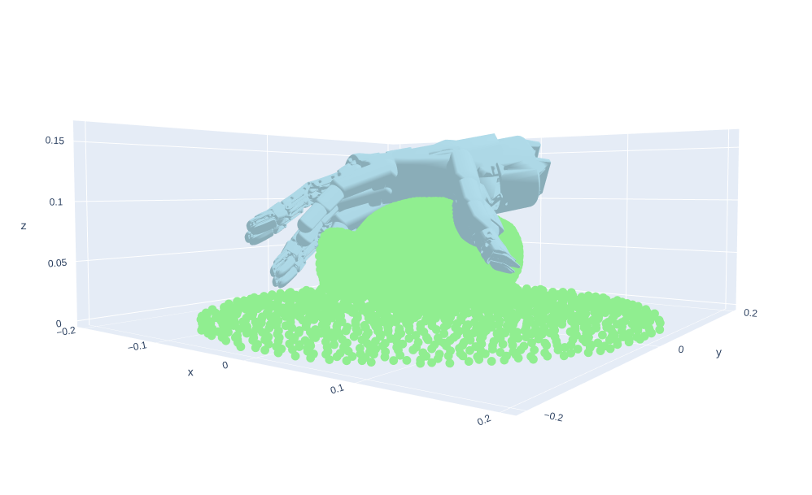

This project has been moved to the new address, please visit https://github.com/linker-bot/linkerhand-unidexgrasp

----

# Linker_UniDexGrasp
This is a codebase that adapts UniDexGrasp for the Linker Hand L20. 

### Diverse Proposal Generation for Dexterous Grasping on linker hand

Please see [README](https://github.com/PKU-EPIC/UniDexGrasp/blob/main/dexgrasp_generation) in `dexgrasp_generation` folder.

### Execution Policy Learning for Dexterous Grasping on linker hand

Please see [README](https://github.com/PKU-EPIC/UniDexGrasp/blob/main/dexgrasp_policy) in `dexgrasp_policy` folder.

